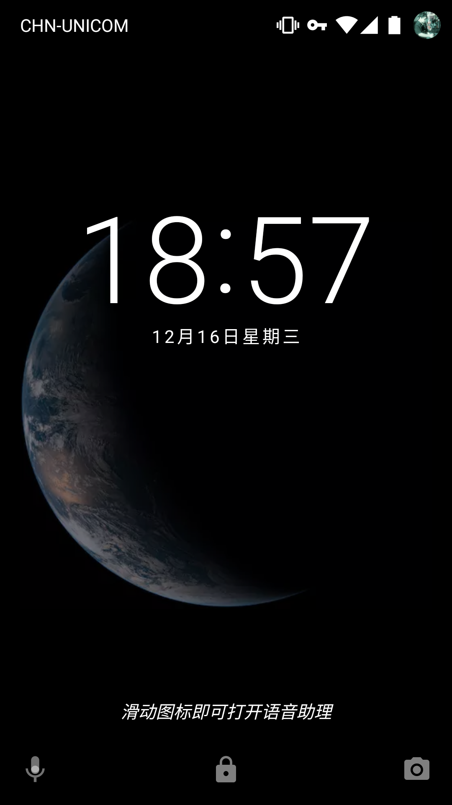

Mantou Earth
==========

[![][license badge]](LICENSE)
[![][issues badge]][issues link]

Fetch photo of the earth every 10 minutes from [himawari-8](http://himawari8.nict.go.jp/) ([wiki](https://en.wikipedia.org/wiki/Himawari_8)), and make them your live wallpaper.

Accelerating with Qiniu CDN and using WebP to reduce network traffic.

[![Get it on Google Play][play badge]][play link]



## Build

### Requirements

- Android SDK Platform 23
- Android Support Repository

```shell
./gradlew build
```

## Thanks

- Inspired by [EarthLiveSharp](https://github.com/bitdust/EarthLiveSharp)
- Images from [himawari-8](http://himawari8.nict.go.jp/)

## Third-party libraries used

- [Glide](https://github.com/bumptech/glide)

## License

[GNU General Public License, version 3](LICENSE)

## Follow us on Wechat


[play badge]: https://developer.android.com/images/brand/en_generic_rgb_wo_45.png
[play link]: https://play.google.com/store/apps/details?id=ooo.oxo.apps.earth

[license badge]: https://img.shields.io/github/license/oxoooo/earth.svg?style=flat-square

[issues badge]: https://img.shields.io/github/issues/oxoooo/earth.svg?style=flat-square
[issues link]: https://github.com/oxoooo/earth/issues
